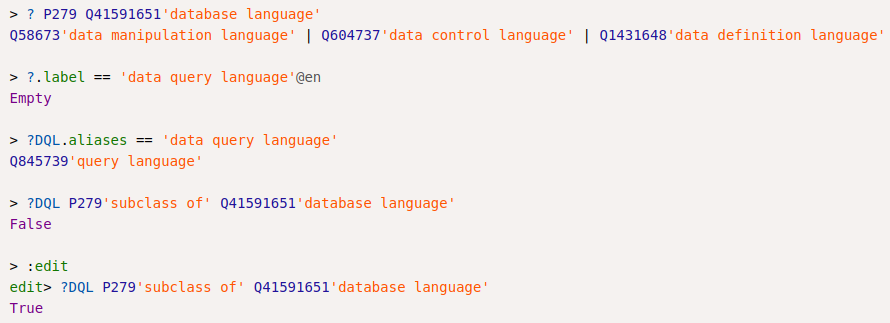
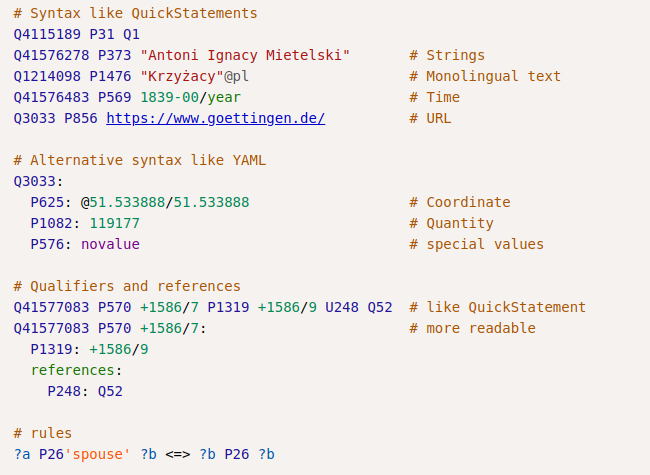

# Data modeling in Wikibase instances: Proposal of a Wikibase database language

---

Scheme language for *any* Wikibase instance

$\longrightarrow$ *Database language* for Wikibase

$\Longrightarrow$ Quality control in Wikidata

---

Wikibase is a database management system, so...

* ...what's it's *database language*?!

* ...where's the *command line*?!

## Database languages

* ~~**DCL** Data control language (access)~~
* **DDL** Data definition language (schema language)
* **DML** Data manipulation language (editing)
* **DQL** Data query language

## Application in Wikidata

1. Data manipulation (editing)
2. Data query (SPARQL...)
3. Data definition (consistency, constraints...)

## Database languages for Wikibase

* **manipulation languages**\
  QuickStatements, wikidata-cli, scripts...

* **query languages**\
  SPARQL, GraphQL, wikidata-cli, scripts...

* **schema languages**\
  property statements & constraints, SheX, scripts...

\normalsize
scripts: JavaScript, Java, Python, Lua, .NET...

## Why another database language for Wikibase?

* Unified syntax for querying, editing & rules

* Current languages are bound to\
  another level of abstraction

  * serialization formats (JSON, RDF)

  * programming languages

## How about something like this?

## What's wrong with existing languages?

* If you have a SPARQL & SheX, everything looks like RDF

* If you have a JavaScript, everything looks like JSON

## Confusion of abstraction

* The Wikibase data model is not RDF, JSON, SQL, CSV...
  but a data model of its own

* Wikibase data language should build on\
  the Wikibase data model

* Syntax matters!

---

## Features of a Wikibase database language

* Wikibase data types as core datatypes
    * entities (items, properties, lexemes...)
    * string, monolingual, quantity ($\supset$ numbers!)
    * coordinates, times
    * media, tabular, shape...

* labels, aliases, claims, sitelinks...

* ranks, novalue, somevalue...

* rules to express expectations

* concise and readable syntax

## Current state

* Draft of a specification
  * <https://github.com/wikicite/kukulu/> (sources)
  * <http://wikicite.org/kukulu/> (HTML)

* A buggy parser and syntax highlighter
  * written in NodeJS with chevrotain
  * throw-away prototype for experimenting

* An available name and its abbreviation (`kkl`):

  &nbsp;***kūkulu*** (Hawaiian): to build, to construct

